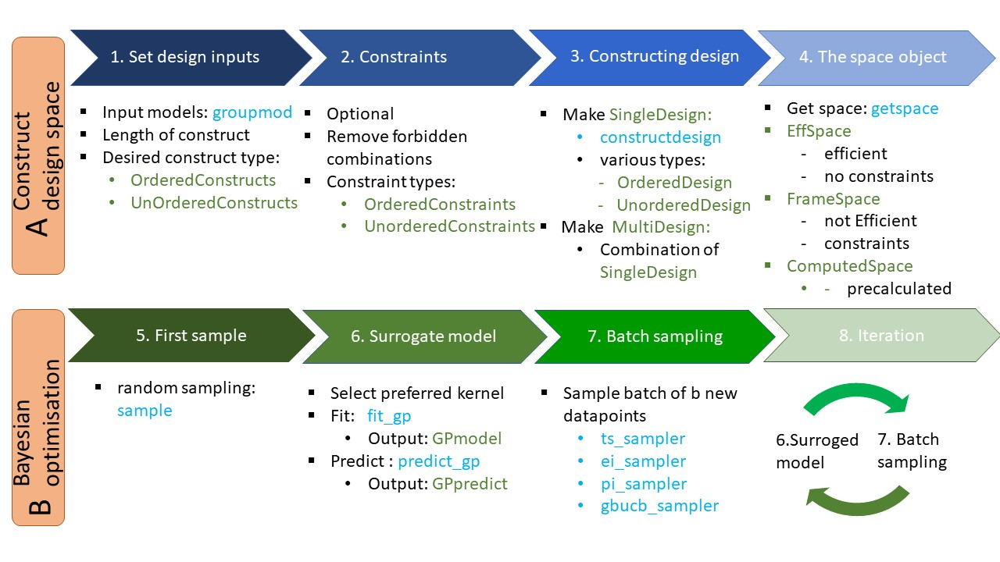

# BOMoD.jl
*A userfriendly package to solve combinatorial modular design optimisation problems within a Bayesian optimisation framework.*

## Introduction
This section describes the implementation of the package. It can be seen as an extended manual, containing all information needed for further development.
In the GitHub repository, a "quick-start" can be found in the README file. Figure below shows an overview of the BOMoD pipeline, blue are functions and green are types





The first section of the manual deals with part A: the construction of the design space.
The second section of the manual deals with part B: the new BO pipeline and how the package deals with the modular design input.

```@contents
Pages = [
    "man/design.md",
    "man/BO_docs.md"
]
```
