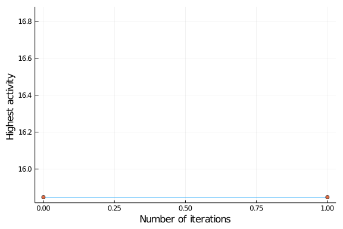
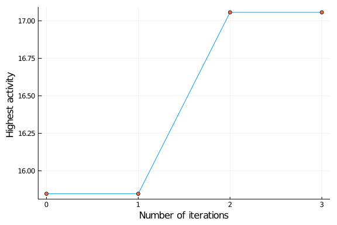
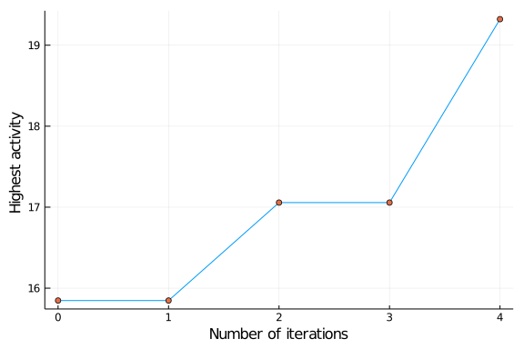

# Illustrations BOMoD.jl


## A Construct Design space


### Input Settings
````julia
using BOMoD
using DataFrames
using Plots

# Input modules u
ice_flavours = groupmod([:Vanilla, :Chocolate, :Strawberry, :Banana, :Pistachio, :Stracciatella, :Almond, :Blackberry, :Coffee, :Lemon, :Cherry, :Caramel, :Ginger, :Hazelnut, :Mango]);
n_scopes = 2
jar = false; # jar = unorderd ice_cream
````


### Constraints
````julia
using BOMoD: Mod
No_Vanilla_Chocolate = UnOrderedConstraint([Mod(:Vanilla), Mod(:Chocolate)])

No_Vanilla_Chocolate_order = OrderedConstraint([1,2],[Mod(:Vanilla), Mod(:Chocolate)]);
````


````
BOMoD.OrderedConstraint{BOMoD.Mod{Symbol}}([1, 2], BOMoD.Mod{Symbol}[BOMoD.
Mod{Symbol}(:Vanilla), BOMoD.Mod{Symbol}(:Chocolate)])
````


### Constructing Design
````julia
design = constructdesign(ice_flavours,n_scopes,order = jar)
````


````
Used modules : {GroupMod}{:Almond, :Banana, :Blackberry, :Caramel, :Cherry,
 :Chocolate, :Coffee, :Ginger, :Hazelnut, :Lemon, :Mango, :Pistachio, :Stra
cciatella, :Strawberry, :Vanilla}
allowed length : 2
constraints : BOMoD.NoConstraint{Nothing}(nothing)
	 	 designspace
 spacetype | BOMoD.FullUnorderedSpace{BOMoD.Mod{Symbol}}
 generated constructs | BOMoD.UnorderedConstruct{BOMoD.Mod{Symbol}}
 n_consturcts | 105
````


###  The Space object
````julia
space = getspace(design);
#index
space[5]
#length
length(space)
#collect
S = collect(space)
````


````
105-element Array{BOMoD.UnorderedConstruct{BOMoD.Mod{Symbol}},1}:
 {UnorderedConstruct}{:Banana, :Almond}
 {UnorderedConstruct}{:Blackberry, :Almond}
 {UnorderedConstruct}{:Blackberry, :Banana}
 {UnorderedConstruct}{:Caramel, :Almond}
 {UnorderedConstruct}{:Caramel, :Banana}
 {UnorderedConstruct}{:Caramel, :Blackberry}
 {UnorderedConstruct}{:Cherry, :Almond}
 {UnorderedConstruct}{:Cherry, :Banana}
 {UnorderedConstruct}{:Cherry, :Blackberry}
 {UnorderedConstruct}{:Cherry, :Caramel}
 ⋮
 {UnorderedConstruct}{:Vanilla, :Chocolate}
 {UnorderedConstruct}{:Vanilla, :Coffee}
 {UnorderedConstruct}{:Vanilla, :Ginger}
 {UnorderedConstruct}{:Vanilla, :Hazelnut}
 {UnorderedConstruct}{:Vanilla, :Lemon}
 {UnorderedConstruct}{:Vanilla, :Mango}
 {UnorderedConstruct}{:Vanilla, :Pistachio}
 {UnorderedConstruct}{:Vanilla, :Stracciatella}
 {UnorderedConstruct}{:Vanilla, :Strawberry}
````


## B Bayesian Optimisation


## (Simulated activities)
````julia
using Random
using Distributions
rng  = MersenneTwister(12);
activities = rand(rng,Uniform(0,10),length(ice_flavours));
toy_data = Dict(ice_flavours .=> activities);
ground_truth(construct,toy_data) = [sum([toy_data[m] for m in c]) for c in construct]
````


````
ground_truth (generic function with 1 method)
````


### Frist sampling step

````julia
n_first = 3;
ice_combinations = sample(rng,space,n_first);
````


````
3-element Array{BOMoD.UnorderedConstruct{BOMoD.Mod{Symbol}},1}:
 {UnorderedConstruct}{:Ginger, :Banana}
 {UnorderedConstruct}{:Mango, :Chocolate}
 {UnorderedConstruct}{:Stracciatella, :Coffee}
````


### Evaluted new data

````julia
lab_μ = ground_truth(ice_combinations,toy_data)
df = DataFrame(ice_combinations = ice_combinations, μ = lab_μ);
maximums = [maximum(df.μ)]
````


````
1-element Array{Float64,1}:
 15.847248649066662
````


### Surrogate model


````julia
##############
# All inputs
#############

# arg
x_train = df.ice_combinations
y_train = df.μ
k = Linear()
# ice_flavours = the modules defined above

# kwarg
optim = true

###################
# Fit the GP model
##################

linear_model = fit_gp(x_train,y_train,k,ice_flavours;optimise = optim)

###############
# Predictions
##############

S = collect(space)
predictions = predict_gp(S,x_train,linear_model,ice_flavours)
````


## Batch sampling step
````julia
new_comb = ts_sampler(predictions,3)
````


````
3-element Array{BOMoD.UnorderedConstruct{BOMoD.Mod{Symbol}},1}:
 {UnorderedConstruct}{:Hazelnut, :Chocolate}
 {UnorderedConstruct}{:Stracciatella, :Almond}
 {UnorderedConstruct}{:Stracciatella, :Chocolate}
````


## Iteration 1
````julia
# evaluation
lab_μ = ground_truth(new_comb,toy_data)
# update training data
df_new = DataFrame(ice_combinations = new_comb, μ = lab_μ);
df = append!(df_new,df)
# find maxium value
push!(maximums,maximum(df.μ))
#  visual
plot(xaxis = "Number of iterations",yaxis = "Highest activity ");
plot!([0:length(maximums)-1],maximums,label = "")
scatter!(([0:length(maximums)-1],maximums),label = "")
````





## Iteration 2
````julia
# setup the model
x_train = df.ice_combinations
y_train = df.μ
# fit model
linear_model = fit_gp(x_train,y_train,k,ice_flavours;optimise = optim)
# predict
predictions = predict_gp(S,x_train,linear_model,ice_flavours)
# sample
new_comb = ts_sampler(predictions,3)
#  update training data
lab_μ = ground_truth(new_comb,toy_data)
df_new = DataFrame(ice_combinations = new_comb, μ = lab_μ);
df = append!(df_new,df)
# visual
push!(maximums,maximum(df.μ))
plot(xaxis = "Number of iterations",yaxis = "Highest activity ");
plot!([0:length(maximums)-1],maximums,label = "")
scatter!(([0:length(maximums)-1],maximums),label = "")
````


## Iteration 3



## Iteration 4....

